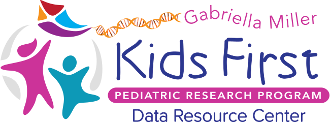

  

  

# Kids First Repository Template

Use this template to bootstrap a new Kids First repository.

### Badges

Update the LICENSE badge to point to the new repo location on GitHub.
Note that the LICENSE badge will fail to render correctly unless the repo has
been set to **public**.

Add additional badges for CI, docs, and other integrations as needed within the
`
` tag next to the LICENSE.

### Repo Description

Update the repositories description with a short summary of the repository's
intent.
Include an appropriate emoji at the start of the summary.

Add a handful of tags that summarize topics relating to the repository.
If the repo has a documentation site or webpage, add it next to the repository
description.
